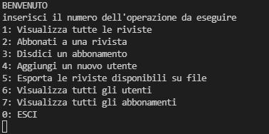

# Java Basics Information
> App per la gestione di abbonamenti a riviste scientifiche



## Compilare, creare il file .jar ed eseguire l'applicazione 

Windows (è necessario aver installato JDK):

Scaricare la cartella in formato zip nel proprio computer e scompattarla. 
Aprire il prompt dei comandi e posizionarsi all'interno della cartella appena scompattata.
Per compilare l'applicazione digitare:
```sh
javac \org\javabasics\Application.java
```
per creare il file jar digitare ora il seguente comando:
```sh
jar cfe application.jar org.javabasics.Application org\javabasics\Application.class org\javabasics\model\*.class  org\javabasics\service\*.class org\javabasics\controller\*.class org\javabasics\csv\*.csv
```
per eseguire l'applicazione digitare
```sh
java -jar application.jar
```
I comandi sopra riportati sono stati testati su windows 10 pro 64 bit con installato jdk-17.0.0.35

## Funzioni dell'applicazione

L'applicazione permette di gestire gli abbonamenti ad un catalogo di riviste scientifiche. Di seguito si riportano i principali comandi dell'applicazione. Il numero relativo al comando che si vuole impartire deve essere inserito nel terminale seguito dal tasto invio. 
* (1) Visualizza tutto le riviste:
Mostra tutte le riviste in catalogo. Per ogni rivista viene mostrato l'ID, il nome, una breve descrizione, prezzo, tipologia e disponibilità.
* (2) Abbonati a una rivista:
Permette di abbonarsi ad una rivista se questa è disponibile. E' necessario fornire l'id della rivista e l'id dell'utente che vuole abbonarsi.
* (3) Disdici un abbonamento:
Consente di disdire un abbonamento. E' necessario fornire l'id dell'abbonamento da disdire.
* (4) Aggiungi un nuovo utente:
Permette di aggiungere un nuovo utente, per ogni utente inserito è necessario fornire un id, un nome, un cognome, una data di nascita (in formato dd/mm/yyyy), un indirizzo e un documento d'identità.
* (5) Esporta le riviste disponibili su file:
Esporta le riviste diposnibile su file .csv nominato con la data del giorno (riviste_dd_mm_yyyy).
* (6) Visualizza tutti gli utenti:
Visualizza tutti gli utenti presenti nell'applicazione.
* (7) Visualizza tutti gli abbonamento:
Visualizza tutti gli abbonamenti presenti nell'applicazione.
* (0) ESCI: Termina l'esecuzione dell'applicazione.
